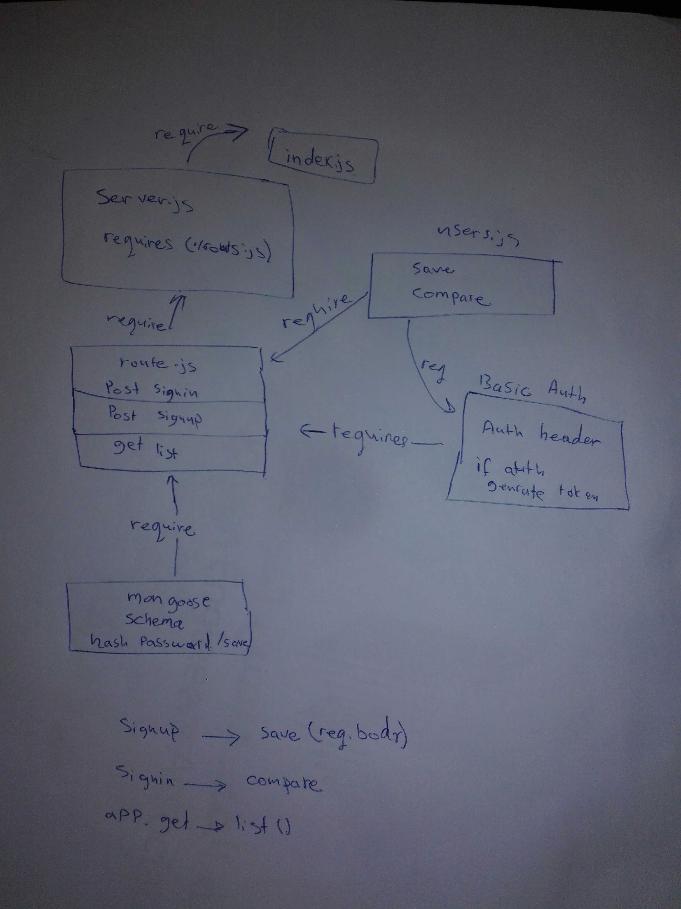

# LAB - Class 12

## Project: Authentication

### Author: Batool Al-Ali

### Links and Resources

- [submission PR](https://github.com/batool-alali-401-advanced-javascript/Authentication/pull/4)
- [ci/cd](https://github.com/batool-alali-401-advanced-javascript/Authentication/runs/747741475)) 

### Setup
- .env => 
    - PORT
    - MONGODB_URI
    - SECRET
    - CLIENT_ID
    - CLIENT_SECRET
    - API_SERVER
    - TOKEN_SERVER

#### How to initialize/run your application 
- `$ npm init -y`
- `$nodemon`

#### Libraries:
- 'dotenv'
- 'express'
- 'supertest' 
- 'mongoose'
- "base-64"
- "bcryptjs"

#### tests:
- `$ npm test`
- `$npm run lint`

#### UML
